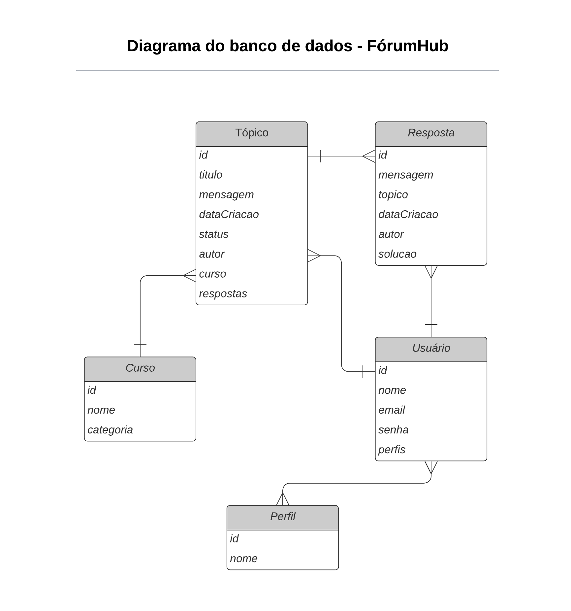

# FórumHub

<p align="left">
  
  
  
  
  
  
  
</p>

___

## 📖 Sobre o projeto

O **FórumHub** é um projeto desenvolvido para o Challenge Back End da Alura, com o objetivo de replicar a lógica de um fórum online no backend.

Neste sistema, usuários podem postar dúvidas, interagir com tópicos e responder perguntas. O desafio foi implementar uma API REST capaz de gerenciar tópicos, usuários e cursos, permitindo:

- Criar, listar, atualizar e deletar tópicos (CRUD completo)
- Listar cursos e usuários
- Autenticar usuários e restringir operações conforme permissões

O projeto reforça conceitos de API REST, persistência relacional, segurança com JWT e boas práticas de desenvolvimento utilizando Spring Boot.

___

## 🛠 Tecnologias

- Java 21
- Spring Boot 3.x
- Maven
- MySQL 8.0
- Docker & Docker Compose
- Flyway (migrações do banco)
- Spring Security + JWT

---

## 🔗 Endpoints

### Autenticação

- `POST /auth/login` - Login


### Usuários

- `POST /usuarios` — Cadastrar novo usuário
- `GET /usuarios/{id}` — Buscar usuário por ID
- `GET /usuarios` — Listar usuários (paginado)
- `PUT /usuarios/{id}` — Atualizar usuário
- `DELETE /usuarios/{id}` — Remover usuário

### Cursos

- `POST /cursos` — Cadastrar novo curso
- `GET /cursos/{id}` — Buscar curso por ID
- `GET /cursos` — Listar cursos (paginado)
- `PUT /cursos/{id}` — Atualizar curso
- `DELETE /cursos/{id}` — Remover curso

### Tópicos

- `POST /topicos` — Criar tópico (usuário autenticado)
- `GET /topicos` — Listar tópicos (paginado)
- `GET /topicos/{id}` — Buscar tópico por ID
- `GET /topicos/por-curso/{nomeCurso}` — Filtrar por curso (paginado)
- `GET /topicos/por-status/{status}` — Filtrar por status (paginado)
- `GET /topicos/por-autor/{autorId}` — Filtrar por autor (paginado)
- `GET /topicos/buscar/?texto=...` — Buscar por texto (paginado)
- `GET /topicos/filtro-combinado?nomeCurso=...&status=...` — Filtro combinado curso e status
- `PUT /topicos/{id}` — Atualizar tópico (apenas autor)
- `DELETE /topicos/{id}` — Excluir tópico (apenas autor)

___

## 🗂 Modelo ER

<p>
  
</p>

___

## 📂 Estrutura do Projeto

```yaml
forum-hub-api/
├── src/
│   ├── main/java/br/com/darlei/forumhub/
│   │    ├── controller/    # Controllers REST
│   │    ├── domain/        # Entidades JPA
│   │    ├── exception/     # Controle de erros 
│   │    ├── dto/           # DTOs de entrada/saída
│   │    ├── repository/    # Repositórios JPA
│   │    ├── service/       # Regras de negócio
│   │    └── security/      # Configuração JWT + filtros
│   └── resources/
│        ├── application.yml # Configurações do Spring
│        └── db/migration/   # Scripts Flyway
├── docker-compose.yml
└── pom.xml
```
___


## 🔐 Segurança

- Autenticação via **JWT**
- Usuários só podem alterar/excluir seus próprios tópicos

### Exemplo de login

```json
POST /auth/login
{
  "email": "user@email.com",
  "senha": "123456"
}
```

O token JWT retornado deve ser enviado no header das requisições protegidas:

```http
Authorization: Bearer SEU_TOKEN_AQUI
```

---

## ▶️ Como Executar

### Usando Docker Compose (recomendado)

1. Suba o container do MySQL:
  ```bash
  docker compose up -d
  ```
2. Execute a aplicação (em outro terminal):
  ```bash
  ./mvnw spring-boot:run
  ```
3. Acesse no navegador:
  [http://localhost:8080](http://localhost:8080)

### Sem Docker

1. Certifique-se de ter o MySQL rodando localmente e configurado conforme o `application.yml`.
2. Execute:
  ```bash
  ./mvnw spring-boot:run
  ```
___

## 🤝 Contribuição

Contribuições são sempre bem-vindas!

1. Faça um fork do projeto
2. Crie uma branch (`git checkout -b feature/nova-feature`)
3. Commit suas mudanças (`git commit -m 'Adiciona nova feature'`)
4. Push para a branch (`git push origin feature/nova-feature`)
5. Abra um Pull Request

___
## 📝 Observações

- Banco em MySQL
- Docker Compose já configurado
- Endpoints completos documentados acima


## ✅ Cobertura de Testes

Todas as rotas da API foram testadas manualmente utilizando o [Insomnia](https://insomnia.rest/), garantindo o funcionamento de autenticação, CRUD de usuários, cursos e tópicos, além das regras de negócio e segurança (JWT).

### Links Úteis

- [Documentação Spring Boot](https://spring.io/projects/spring-boot)
- [Documentação JWT](https://jwt.io/introduction)
- [Documentação Docker](https://docs.docker.com/)
- [Desafio Back End Alura](https://www.alura.com.br/challenges/back-end)